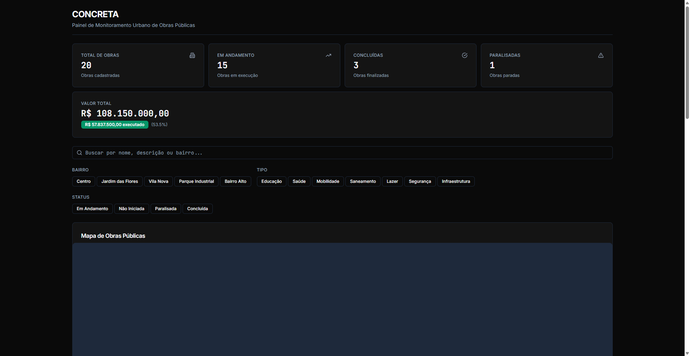
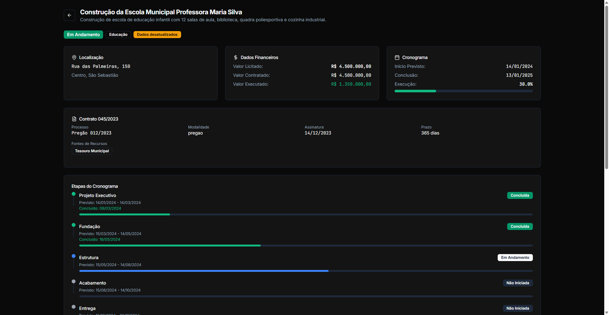

# CONCRETA - Painel de Monitoramento Urbano de Obras Públicas

## Visão Geral do Projeto

CONCRETA é um sistema de transparência pública para acompanhamento de obras públicas municipais. O objetivo principal é traduzir orçamentos e cronogramas complexos em um mapa interativo e de fácil compreensão, abrangendo todo o ciclo de vida das construções da cidade - desde o valor licitado até o percentual real de execução nos canteiros de obras.

A plataforma foi desenvolvida para estabelecer um pilar de rigor e integridade na gestão pública, oferecendo ao cidadão informações sólidas e inabaláveis que sirvam como base para cobrar o cumprimento de prazos e o uso correto do dinheiro público.

## Funcionalidades Principais

### Mapa Interativo
- Visualização de todas as obras públicas em mapa interativo com markers colorizados por status
- **Marker Clustering**: Agrupamento automático de markers para melhor performance com grandes volumes de dados (1000+ obras)
- Popup com informações resumidas ao clicar em cada marker (nome, endereço, percentual de execução)
- Mapas com Leaflet para performance e interatividade

### Detalhes Completos de Cada Obra
- Valor licitado, valor contratado e valor executado
- Cronograma com etapas planejadas vs executadas
- Gráficos de evolução comparando execução planejada versus real
- Informações sobre aditivos contratuais
- Fotos do canteiro de obras (quando disponíveis)
- Fonte de recursos (federal, estadual, municipal)

### Filtros e Busca
- Busca por nome da obra
- Filtro por bairro/região
- Filtro por tipo de obra (Educação, Saúde, Mobilidade, Saneamento, Lazer, Segurança, Infraestrutura)
- Filtro por status (Em Andamento, Não Iniciada, Paralisada, Concluída)
- Ordenação por nome ou valor

### Recursos de Transparência
- Indicador visual de dados desatualizados (mais de 30 dias sem atualização)
- Destaque de obras com aditivos contratuais
- Exibição de diferenças entre valor licitado e contratado
- Identificação de obras paralisadas com motivo

### Exportação
- Exportação para CSV com dados completos
- Exportação para PDF via impressão do navegador
- Opção de incluir detalhes extras no export

## Tech Stack

- **Framework**: Next.js 14 (App Router)
- **Linguagem**: TypeScript 5.x
- **Estilização**: Tailwind CSS com Dark Mode
- **Componentes**: Shadcn/ui (Radix UI)
- **Mapa**: Leaflet + react-leaflet + leaflet.markercluster
- **Estado**: Zustand
- **Gráficos**: Recharts
- **Testes**: Playwright + Vitest + React Testing Library

## Estrutura do Projeto

```
concreta/
├── frontend/                  # Aplicação Next.js
│   ├── src/
│   │   ├── app/              # App Router pages
│   │   │   ├── page.tsx      # Página principal (dashboard)
│   │   │   └── obras/[id]/   # Páginas de detalhes
│   │   ├── components/      # Componentes React
│   │   │   ├── ui/           # Componentes base (shadcn)
│   │   │   ├── map/          # Componentes do mapa
│   │   │   ├── dashboard/    # Componentes do dashboard
│   │   │   ├── obra/         # Componentes de detalhes da obra
│   │   │   ├── charts/       # Gráficos Recharts
│   │   │   └── providers/     # Providers (WebVitals, Keyboard)
│   │   ├── hooks/           # Custom hooks
│   │   ├── store/           # Zustand stores
│   │   ├── types/           # TypeScript types
│   │   ├── data/mock/       # Dados mockados
│   │   └── lib/             # Utilitários
│   ├── tests/               # Arquivos de teste
│   │   ├── e2e/             # Testes E2E (Playwright)
│   │   ├── unit/            # Testes unitários (Vitest)
│   │   └── components/      # Testes de componentes (RTL)
│   ├── lighthouserc.json    # Configuração Lighthouse CI
│   └── package.json
├── screenshots/             # Screenshots do projeto
└── specs/                  # Especificações do projeto
    └── 001-urbano-monitoramento-obras/
```

## Getting Started

```bash
# Entrar no diretório do frontend
cd frontend

# Instalar dependências
npm install

# Iniciar servidor de desenvolvimento
npm run dev
```

Abra [http://localhost:3000](http://localhost:3000) para visualizar o projeto.

## Scripts Disponíveis

```bash
npm run dev         # Servidor de desenvolvimento
npm run build       # Build de produção
npm run start       # Servidor de produção
npm run lint        # Verificação ESLint
npm run typecheck   # Verificação TypeScript
npm run test        # Testes unitários (Vitest)
npm run test:coverage # Testes com cobertura
npm run test:e2e    # Testes E2E (Playwright)
```

## Testes

O projeto inclui três tipos de testes:

### Testes Unitários (Vitest)
```bash
npm run test
npm run test:coverage
```

### Testes de Componentes (React Testing Library)
Localizados em `tests/components/`

### Testes E2E (Playwright)
```bash
npm run test:e2e
```

## Lighthouse CI

O projeto inclui configuração para Lighthouse CI que verifica:
- Performance (mínimo 70%)
- Accessibility (mínimo 90%)
- Best Practices (mínimo 80%)
- SEO (mínimo 80%)

Para executar localmente:
```bash
cd frontend
npm install -g @lhci/cli@0.13.x
lhci autorun
```

## Cores do Status

| Status | Cor | Significado |
|--------|------|-------------|
| Em Andamento | Verde | Obra em execução normal |
| Concluída | Azul | Obra finalizada |
| Paralisada | Amarelo | Obra temporariamente suspensa |
| Não Iniciada | Cinza | Contrato assinado, obra não começou |

## Dados Mockados

O sistema inclui 20 obras de exemplo cobrindo:
- Escolas e creches (Educação)
- UBS e Hospital (Saúde)
- Pavimentação e corredor de ônibus (Mobilidade)
- Sistema de esgotamento sanitário (Saneamento)
- Centros esportivos e parques (Lazer)
- Centro de convenções e estações de metrô (Infraestrutura)

**Localização**:
- 15 obras em São Sebastião (SP)
- 5 obras em Brasília (DF) - Asa Sul, Asa Norte, Setor Sul, Samambaia, Taguatinga

Cada obra inclui:
- Dados financeiros (valor licitado, contratado, executado)
- Cronograma com etapas
- Histórico de execuções
- Fotos (mockadas com placeholder)

## Acessibilidade

- Skip link para conteúdo principal
- Navegação por teclado completa
- ARIA labels e roles
- Alto contraste em Dark Mode
- Contraste de cores WCAG 2.1 AA
- **Focus trap** para modais e dropdowns
- Atalhos de teclado:
  - `Ctrl+K` ou `Cmd+K`: Focar na busca
  - `Escape`: Limpar busca ou fechar modal
- Annúncios ARIA para alterações de filtro

## Preferências do Sistema

- Suporte a `prefers-reduced-motion` para usuários que preferem menos animações
- Dark mode automático baseado nas preferências do sistema
- Monitoramento de Core Web Vitals integrado

## Monitoramento de Performance

O projeto inclui monitoramento de Core Web Vitals:
- **LCP** (Largest Contentful Paint)
- **FID** (First Input Delay)
- **CLS** (Cumulative Layout Shift)
- **TTFB** (Time to First Byte)
- **FCP** (First Contentful Paint)

## Prints do Projeto

### Página Inicial (Dashboard)



A página inicial exibe:
- Cabeçalho com título "CONCRETA - Painel de Monitoramento Urbano de Obras Públicas"
- Cards de estatísticas: Total de Obras (20), Em Andamento (15), Concluídas (3), Paralisadas (1)
- Valor Total: R$ 108.150.000,00 (R$ 57.837.500,00 executado - 53.5%)
- Filtros por bairro, tipo de obra e status
- Mapa interativo com markers das obras
- Lista de obras com ordenação

### Detalhes da Obra



A página de detalhes de cada obra exibe:
- Nome e descrição da obra
- Badges de status, tipo e indicadores especiais
- Cards de localização, dados financeiros e cronograma
- Detalhes do contrato com informações de processo, modalidade, fontes de recursos
- Lista de aditivos contratuais
- Cronograma de etapas com progresso
- Gráficos de evolução da execução

## Licença

MIT